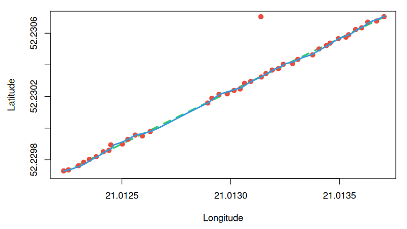

# gps_cleaner

An advanced 2D Kalman Filter and linear interpolation toolkit for GPS trajectory smoothing and analysis, implemented in R with a high-performance C backend via the `.Call` interface.

The package is specifically designed to handle raw GPS data , offering dual-layer protection against telemetry anomalies: an R-level distance-velocity gate for severe outlier rejection and a native C Kalman core for optimal noise reduction.

## Installation

You can install the development version of `gpscleaner` using one of the two methods below:

### Method 1: Directly from R (Recommended)
You can install the package directly from GitHub using the `devtools` package. Run the following command inside your R console:

```R
# If you don't have devtools installed yet:
# install.packages("devtools")

devtools::install_github("nomysz05/projekt-pakiety")

### Method 2: From the Terminal via Git Clone
If you prefer to download the source code manually, clone the GitHub repository, navigate into the main directory, and install it using the native R compiler toolchain:

```bash
# Clone the repository
git clone https://github.com/nomysz05/projekt-pakiety.git

# Navigate into the project folder
cd projekt-pakiety

# Install the package using R's package manager
R CMD INSTALL .


## Usage

library(gpscleaner)

# 1. Clean noisy GPS data
clean_data <- noise_cleaner(
  time = c(0, 1, 2, 3),
  lat  = c(52.2, 52.2001, 52.2002, 52.2003),
  lon  = c(21.0, 21.0001, 21.0002, 21.0003),
  speed = c(13.0, 13.0, 13.0, 13.0),
  sigma_a = 0.8,
  sigma_gps = 1.0
)

# 2. Interpolate missing data points
interp_data <- interpolate_gps(
  time = c(0, 1, 2, 3, 4),
  lat  = c(52.2, NA, NA, 52.2003, 52.2004),
  lon  = c(21.0, NA, NA, 21.0003, 21.0004),
  speed = c(13.0, 13.0, 13.0, 13.0, 13.0)
)


### Visual Performance Verification

The example below demonstrates the package's capability to process distorted trajectory data using a straight-line movement test case:

* **Green Dashed Line**: The true, ideal linear trajectory.
* **Red Dots**: Raw simulated GPS data containing standard measurement noise, a multi-second signal dropout (`NA` gap), and a severe positional outlier jump (multipath simulation).
* **Blue Line**: The final output computed by `gpscleaner`.

The package successfully reconstructs the missing data points via time-based linear interpolation and deploys the C-implemented 2D Kalman filter to reject the massive outlier jump completely, keeping the path physically continuous and smooth.



## API Parameters Reference

The package provides two main functions: `gps_noise_cleaner` (for dual-layer filtering) and `interpolate_gps` (for data gap reconstruction). Below is the detailed specification of all parameters used across the toolkit.

### Detailed Parameter Matrix

| Parameter | Type | Default Value | Units / Range | Target Function(s) | Description |
| :--- | :--- | :--- | :--- | :--- | :--- |
| **`time`** | `numeric vector` | *Required* | Seconds (`s`) | Both | Monotonically increasing sequence of timestamps. |
| **`lat`** | `numeric vector` | *Required* | Degrees [$\pm90$] or Semicircles | Both | Latitude coordinates. Supports automatic Garmin semicircle detection. Can contain `NA` for interpolation. |
| **`lon`** | `numeric vector` | *Required* | Degrees [$\pm180$] or Semicircles | Both | Longitude coordinates. Supports automatic Garmin semicircle detection. Can contain `NA` for interpolation. |
| **`speed`** | `numeric vector` | *Required* | Meters per second (`m/s`) | Both | Instantaneous speed profile. Can contain `NA` values for `interpolate_gps`, which will be automatically reconstructed. |
| **`sigma_a`** | `numeric` | `0.8` | $> 0$ | `gps_noise_cleaner` | **Process Noise:** Controls expected acceleration changes. Higher values allow the filter to adapt faster to rapid shifts. |
| **`sigma_gps`** | `numeric` | `1.0` | Meters (`m`) | `gps_noise_cleaner` | **Measurement Noise:** Represents expected GPS positional error. Higher values make the filter trust the physical model more than the raw signal. |
